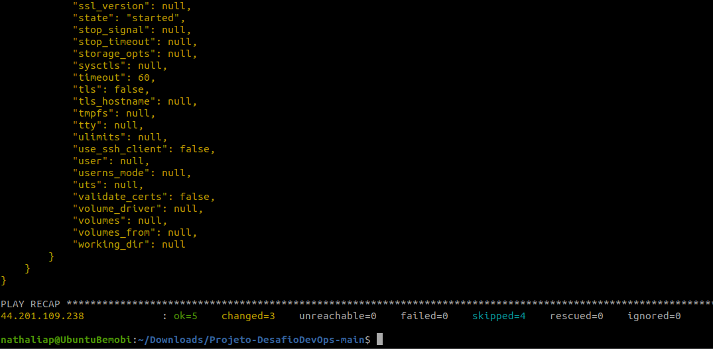
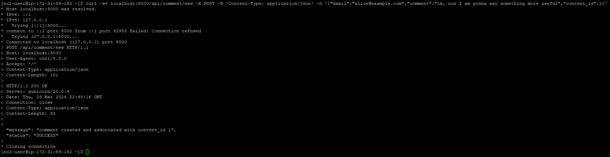

Antes de iniciar tudo, peguei tudo o que está sendo pedido e pensei no que iria fazer e o que iria utilizar.
Como não tenho muita experiência, somente estudos/cursos, não tenho conhecimento de muitas formas de fazer esse passo a passo de um devops (plan, code, build, test, release e o deploy).

Obs: Para um projeto mais "limpo" vou evitar ficar utilizando muitos commits.

1 Automação da infra, provisionamento dos hosts (IaaS)

Aqui utilizarei EC2 via terraform, até o momento é a única forma que conheço de automação de infra.
Se não fosse necessário utilizar IaaS poderia utilizar AWS Beanstalk ou ECS com Fargate.

Para isso fiz o Dockerfile e buildei a imagem para o DockerHub e farei a configuração em cima dessa imagem.

2 Automação de setup e configuração dos hosts (IaC)

Aqui única ferramenta que conheço no momento e que pode fazer o que está sendo pedido é o Ansible.

3 Pipeline de deploy automatizado

Aqui poderia utilizar gitlab, github actions, jenkins, mas até o momento tenho conhecimento suficiente para utilizar gitlab.

4 Monitoramento dos serviços e métricas da aplicação

Aqui poderia utilizar o próprio AWS Cloudwatch, mas também Prometheus com Grafana, estou pensando qual opção irei utilizar.
Tenho mais conhecimento em AWS Cloudwatch, Grafana já trabalhei, mas já estava todo configurado, prometheus tenho um curso básico.

26/03 - 23h24
Testes iniciados com o terraform pronto, localmente utilizando o terraform init, terraform plan está funcionando.

26/03 - 23h49
Tentando rodar o pipeline, mas retornando erro, tentando testar somente o terraform, sem o ansible para verificar se roda corretamente.

27/03 - 08h42
Tentando alterar o pipeline, pois está retornando erro.

27/03 - 17h28
Mudei algumas coisas no arquivo de pipeline. Mudei o dockerfile, pois antes estava dando erro. Fiz uns testes locais e agora está ok.
Agora preciso ajustar tudo pro pipeline funcionar, visto que não tenho muito conhecimento de ansible e também na hora de integrar tudo um pouco de dificuldades, visto que estudei as ferramentas separadamente, na hora de utilizar tudo junto é um pouco complexo para mim.

27/03 - 18h44
No pipeline está retornando um erro no momento do terraform, tentando resolver adicionando uma linha após "image"

27/03 - 22h17
Estou tentando editar o arquivo do pipeline, pois na hora do terraform está dando erro nas variáveis, tentando ajustar para dar certo.

27/03 - 22h33
Ainda na tentativa de arrumar o pipeline que continua dando erro no terraform nas variáveis.

27/03 - 23h50
Consegui fazer o pipeline funcionar, passou da parte das variáveis, concluiu o pipeline com sucesso, mas depois na parte do ansible ele não conseguiu localizar o ip do host que foi criado pelo terraform e não fez a configuração necessária da api no host.

28/03 - 17h48
Como não estou conseguindo via pipeline funcionar a configuração do host via ansible. Vou tirar a parte do ansible e fazer separado provavelmente. Infelizmente tenho pouco conhecimento em ansible no geral. Nunca tinha precisado utilizar.

28/03 - 19h10
Tirei o ansible do pipeline e vou tentar executar o ansible separadamente, menos automatizado, mas como não estou conseguindo no pipeline por falta de conhecimento, vai ser a única forma.

28/03 - 19h50
Após pesquisar via chatgpt como poderia fazer via ansible separadamente, fiz os arquivos deploy_app.yml, inventory.ini e fiz com sucesso o deploy da api.

Teste feito pelo curl

---

28/03 - 19h58
A parte da containerização está feita, tudo que eu podia automatizar foi feito, não consegui fazer com o ansible via pipeline, mas me falta conhecimento.
Enviado para o gitlab os arquivos - Dockerfile, Terraform (main.tf, variables.tf), Ansible (deploy_app.yml e inventory.ini, mas não foram utilizados, somente para documentar), e o arquivo de pipeline (.gitlab-ci.yml)
No pipeline ele constrói a imagem docker da aplicação, e cria a infraestrutura necessária na AWS usando o Terraform.

28/03 - 20h08
Tinha me esquecido a parte de monitoramento que foi pedido, vou verificar até que ponto posso utilizar Cloudwatch e ver a possibilidade do prometheus.

29/03 - 17h43
Quis tentar novamente adicionar o ansible ao pipeline após fazer uma pesquisa e pensar em como poderia ficar

29/03 - 22h16
Não consegui fazer funcionar o ansible via pipeline, tentei de várias formas, mas me falta conhecimento mesmo. Vou agora focar na parte de monitoramento.

30/03 - 17h40
Comecei a fazer o diagrama, para depois continuar no monitoramento que vou tentar utilizar o Prometheus.

31/03 - 00h34
Fiquei desde o final da tarde tentando fazer o Prometheus funcionar, mas os "alerts" ficavam inactive e não conseguia fazer com que funcionassem corretamente via Blabkbox e Alertmanager.

31/03 - 01h02
Pesquisei e tentei utilizar agora o Prometheus, com Grafana e está funcionando.

31/03 - 12h13
Passei a manhã toda vendo essa parte de monitoramento, achei dashboard prontos que não sabia que existiam em https://grafana.com/grafana/dashboards/?search=Blackbox+Exporter 
Estou usando Prometheus, Blackbox Exporter e Grafana.

31/03 - 17h24
Fazendo alguns ajustes no monitoramento.
